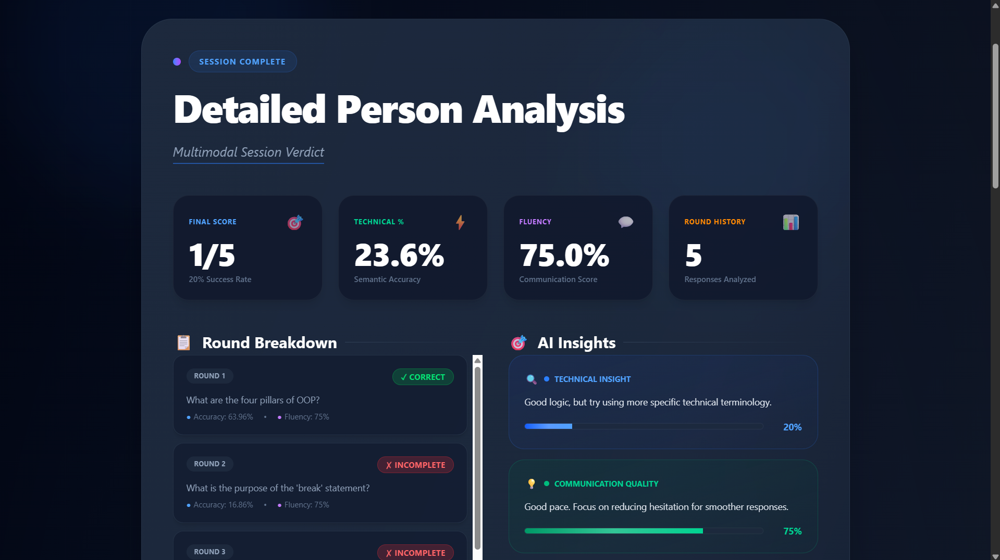

```markdown
# 🚀 Veritas: AI-Powered Multimodal Interview Evaluator

**Veritas** is a high-performance, full-stack AI interview platform developed for the **IIIT Nagpur Hackathon**. It moves beyond simple keyword matching by using a **Multimodal Fusion Engine** to evaluate candidates through three critical lenses: **Technical Accuracy (NLP)**, **Verbal Fluency (Linguistics)**, and **Behavioral Resilience (Computer Vision)**.

 

## 📽️ Live Demonstration & Visuals

> **Placement Tip:** Place your high-impact "Home Screen" image here to immediately show the professional UI.




## 🌟 Key Features

### 1. 🧠 Multimodal Fusion Engine
Veritas doesn't just read your text; it feels your performance.
* **Semantic NLP:** Uses `SentenceTransformers` (all-MiniLM-L6-v2) to map conceptual understanding rather than rigid word matching.
* **Emotion HUD:** Real-time facial expression analysis using `DeepFace` to track confidence and stress.
* **Linguistic Analysis:** Detects verbal fillers (um, uh, like) and calculates a realistic Fluency Score based on speech pace.

### 2. ⚡ Rapid Fire Technical Engine
Designed to test endurance and quick thinking.
* **Difficulty Tiers:** Easy (5 Qs), Medium (10 Qs), and Hard (20 Qs) rounds.
* **Zero-Repeat Logic:** Smart session tracking ensures you never get the same question twice in a single session.

### 3. 📊 Detailed Person Analysis (DPA)
Post-interview feedback that provides a complete psychological and technical verdict.
* **Accuracy vs. Fluency:** Side-by-side metrics showing where your technical knowledge and communication skills diverge.
* **Behavioral Verdict:** Visual markers showing "Smiling/Confident" vs. "Anxious/Unfocused" intervals.

> **Placement Tip:** Insert your "Smiling Face Review" and "Stay Focused Review" images here side-by-side using the table below.

|  |  |
| :---: | :---: |
| *High Confidence Detected* | *Stay Focused Alert* |

---

## 🏗️ System Architecture


The system is split into two specialized service layers:
1. **App Core (MERN Stack):** Manages user sessions, question banks (MongoDB), and the React-based hardware interface.
2. **AI Engine (FastAPI):** An asynchronous Python service that handles the heavy-lifting of NLP and Computer Vision.

---

## 🛠️ Tech Stack

* **Frontend:** React.js, Tailwind CSS, Web Speech API (Voice-to-Text).
* **Backend:** Node.js, Express, MongoDB Atlas (MERN).
* **AI Core:** Python, FastAPI, Sentence-Transformers, DeepFace (OpenCV/TensorFlow).

---

## 🚀 Installation & Setup

### 1. AI Engine (The Brain)
```bash
cd ai-engine
python -m venv venv
# Windows: venv\Scripts\activate
pip install -r requirements.txt
python main.py

```

### 2. App Core (The Heart)

```bash
cd server
npm install
node seed.js # Populates multi-stack question bank
npm start

```

---

## 🤝 Acknowledgments

* **Institution:** Developed for the Hackathon at **Indian Institute of Information Technology (IIIT), Nagpur**.

```

---
